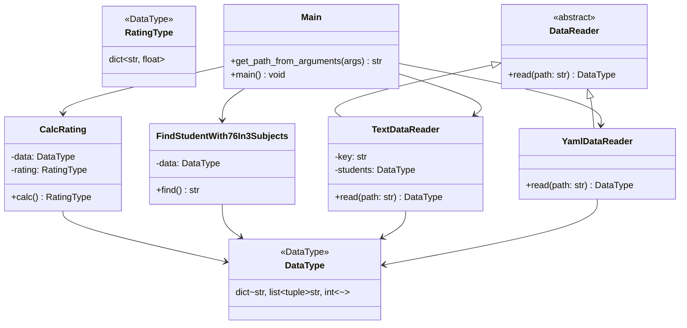

# Лабораторная 1 по дисциплине "Технологии программирования"

## UML-диаграмма классов

```mermaid
classDiagram
    %% Основные типы
    class DataType {
        <<DataType>>
        dict~str, list~tuple~str, int~~~
    }
    
    class RatingType {
        <<DataType>>
        dict~str, float~
    }

    %% Абстрактный класс и его наследники
    class DataReader {
        <<abstract>>
        +read(path: str) DataType
    }
    
    class TextDataReader {
        -key: str
        -students: DataType
        +read(path: str) DataType
    }
    
    class YamlDataReader {
        +read(path: str) DataType
    }
    
    %% Классы для расчетов
    class CalcRating {
        -data: DataType
        -rating: RatingType
        +calc() RatingType
    }
    
    class FindStudentWith76In3Subjects {
        -data: DataType
        +find() str
    }
    
    %% Главный класс
    class Main {
        +get_path_from_arguments(args) str
        +main() void
    }
    
    %% Связи между классами
    DataReader <|-- TextDataReader
    DataReader <|-- YamlDataReader
    
    CalcRating --> DataType
    FindStudentWith76In3Subjects --> DataType
    TextDataReader --> DataType
    YamlDataReader --> DataType
    
    Main --> TextDataReader
    Main --> YamlDataReader
    Main --> CalcRating
    Main --> FindStudentWith76In3Subjects
```